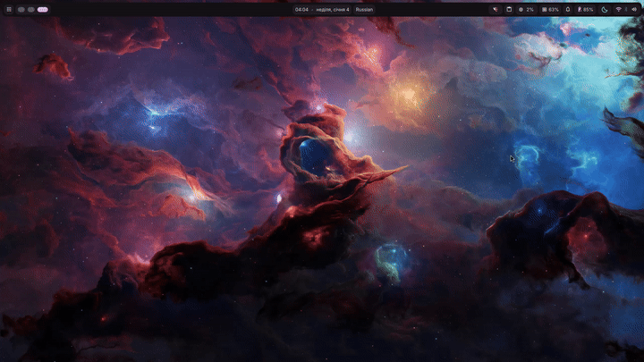

# Keyboard Layout OSD for Niri

Beautiful on-screen display notification that shows your current keyboard layout when you switch between languages in Niri compositor.


## ✨ Features

- 🎨 **Material Design** - Clean, modern OSD that matches DankMaterialShell aesthetic
- ⚡ **Fast & Lightweight** - Minimal resource usage, instant response
- 🔄 **Auto-restart** - Resilient daemon that recovers from errors
- 🎯 **Niri Native** - Specifically designed for Niri compositor
- 🌐 **Multi-language** - Works with any keyboard layout

## 📸 Screenshots

<!-- Add your screenshots here -->


## 📋 Requirements

- **DankMaterialShell** (latest version)
- **Niri** compositor
- **Bash** (for layout monitoring)

## 🚀 Installation

### Quick Install

1. Create plugin directory:
```bash
mkdir -p ~/.config/DankMaterialShell/plugins/KeyboardLayoutOSD
cd ~/.config/DankMaterialShell/plugins/KeyboardLayoutOSD
```

2. Download plugin files:
```bash
# Clone or download the repository
git clone https://github.com/alfeatingcats/dms-keyboard-layout-osd.git .
```

3. Restart DankMaterialShell or enable the plugin in Settings → Plugins

### Manual Install

Copy these files to `~/.config/DankMaterialShell/plugins/KeyboardLayoutOSD/`:
- `plugin.json`
- `KeyboardLayoutWatcher.qml`
- `KeyboardLayoutOSD.qml`

## ⚙️ Configuration

Edit `KeyboardLayoutOSD.qml` to customize:

```qml
osdWidth: 200              // Width in pixels
osdHeight: 80              // Height in pixels
autoHideInterval: 1500     // Display duration (ms)
```

Edit `KeyboardLayoutWatcher.qml` to adjust monitoring:

```bash
sleep 0.3  # Check interval (seconds)
```

## 🎨 Customization

### Show Short Codes Instead of Full Names

Edit the bash script in `KeyboardLayoutWatcher.qml`:

```bash
# Replace the sed line with a case statement:
case "$new" in
    "English (US)") echo "EN" ;;
    "Russian") echo "RU" ;;
    "Ukrainian") echo "UA" ;;
    *) echo "$new" ;;
esac
```

### Change Icon

In `KeyboardLayoutOSD.qml`, modify:
```qml
DankIcon {
    name: "keyboard"  // Try: "input-keyboard", "language", etc.
}
```

## 🐛 Troubleshooting

### OSD doesn't appear

Check if Niri command works:
```bash
niri msg keyboard-layouts
```

Check DMS logs:
```bash
journalctl --user -u dms -f
```

### Wrong layout detected

Test the monitoring script manually:
```bash
while true; do
    output=$(niri msg keyboard-layouts 2>/dev/null)
    new=$(echo "$output" | grep '\*' | sed 's/.*\* [0-9]\+ //' | xargs)
    [ -n "$new" ] && echo "Detected: $new"
    sleep 0.3
done
```

## 🗑️ Uninstallation

```bash
rm -rf ~/.config/DankMaterialShell/plugins/KeyboardLayoutOSD
# Restart DankMaterialShell
```

## 📄 License

This project is licensed under the MIT License - see the [LICENSE](LICENSE) file for details.

## 🙏 Acknowledgments

- [DankMaterialShell](https://github.com/AvengeMedia/DankMaterialShell) for the amazing desktop environment
- [Niri](https://github.com/YaLTeR/niri) for the modern Wayland compositor
- [Quickshell](https://quickshell.org) for the powerful QML framework

